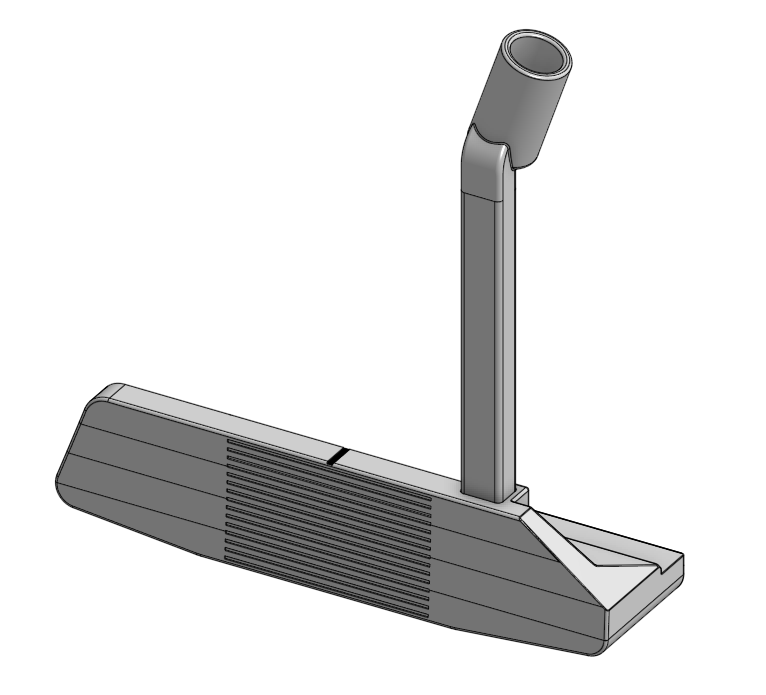
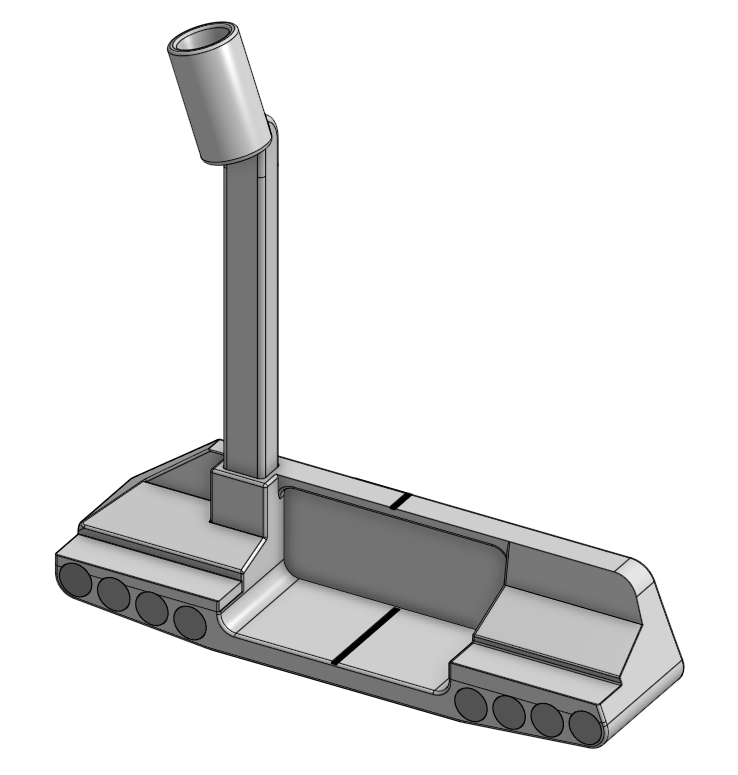

# Zero-Torque-Blade-Putter

This project is a fully custom-designed blade-style putter developed from scratch in CAD. The primary objective was to explore mass distribution, alignment geometry, and precision modeling techniques while designing a performance-focused golf club head.

The design emphasizes:

- Increased forgiveness through optimized mass placement

- Clean visual alignment at address

- Balanced feel throughout the stroke

- Manufacturable geometry for CNC production

This project served as both a mechanical design exercise and a performance-oriented sports engineering study.

# Design Objectives

- Improve resistance to twisting on off-center strikes (increase MOI)

- Reduce overall head mass to improve distance control and stroke consistency

- Maintain a traditional blade aesthetic

- Optimize CG positioning relative to face plane and shaft axis

- Ensure proper loft and lie geometry

- Maintain symmetry and precision in all modeled features

# Design for Manufacturing

- CNC-friendly geometry considerations

- Avoidance of undercuts

- Edge radii suitable for machining tools

- Tolerance awareness in mating surfaces

# Iterative Design Process

The design evolved through multiple revisions, focusing on:

- Adjusting head mass distribution

- Refining alignment features

- Improving visual framing at address

- Optimizing overall proportions

Each iteration was evaluated for both performance potential and manufacturability.

# What I Learned

- How small geometric changes significantly affect mass properties

- The importance of parametric design when iterating performance equipment

- Balancing aesthetics with engineering constraints

- How to design components with real-world manufacturing in mind

- Structured design thinking from concept → refinement → evaluation

# Future Development

Potential next steps include:

- Prototype machining and tolerance validation

- Face texture experimentation

- Further CG optimization testing

- Performance testing with larger sample sizes
